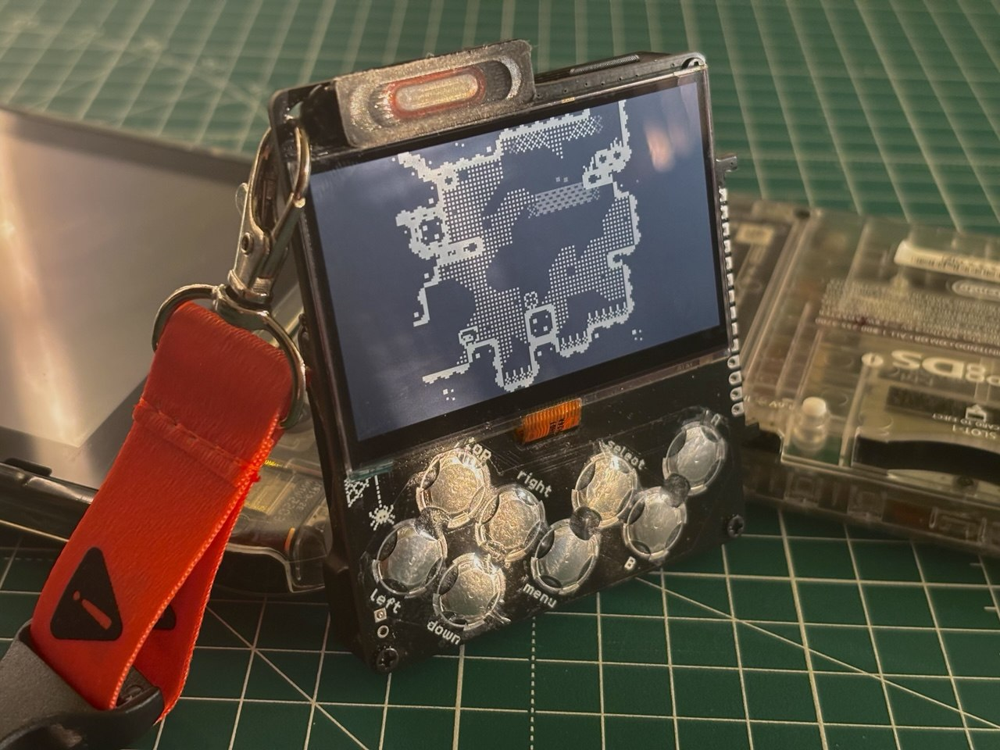
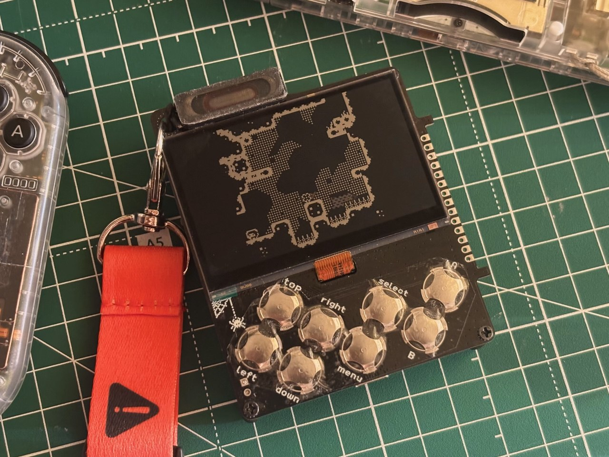
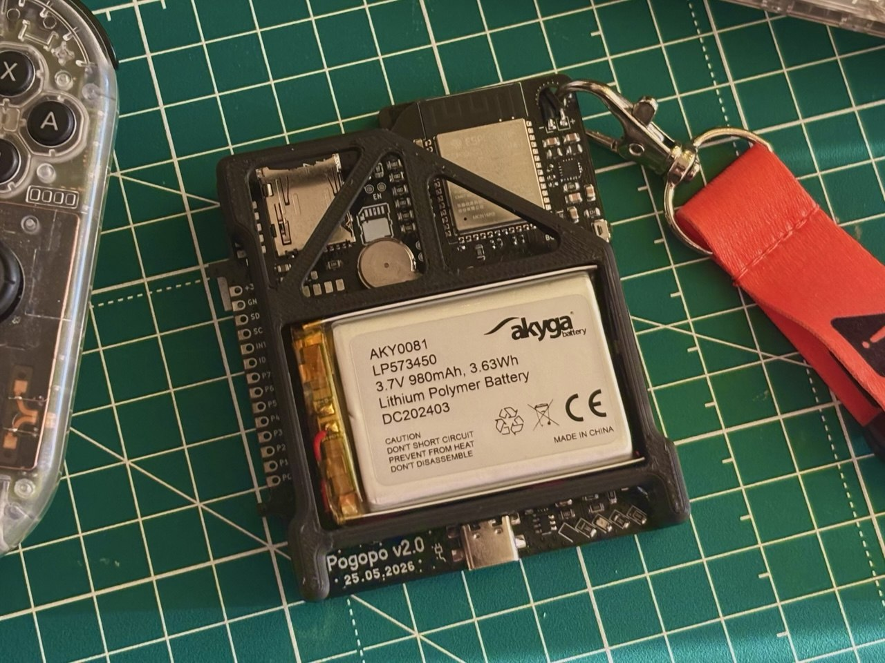

# Pogopo

*Both Pogopo and PogopoOS are still in the early stages of development.*

[@lastlxrd](https://github.com/lastlxrd) 2026

  

  

  

## Getting Started

Pogopo is still under active development. More complete documentation will be added as the hardware and software mature.

[Documentation](https://pogopo.github.io/pogopoOS/)
[FAQ](https://pogopo.github.io/pogopoOS/faq.html) 

## Project Summary

Pogopo is a custom hand-built handheld console based on the ESP32-S3. It combines a low-power monochrome display, physical controls, audio, motion sensing, removable storage, haptic feedback, and custom power management in one compact device.

The goal is to create a standalone handheld capable of running native applications, utilities, emulators, and custom games through a simple graphical interface. The current device is a working development prototype, with both its hardware and software continuing to evolve.

## Hardware

- ESP32-S3 with 16 MB flash and 8 MB PSRAM
- Sharp LS027B7DH01 400 × 240 Memory LCD
- BMI270 motion sensor
- MAX98357A I2S audio amplifier
- microSD card over 4-bit SDMMC
- TCA9555 GPIO and button expander
- D-pad, A, B, Menu, Start, and Power controls
- Vibration motor
- Rechargeable battery
- Onboard charging and power management
- Custom PCB and 3D-printed enclosure

## PogopoOS

PogopoOS is the custom operating system and application platform developed specifically for the Pogopo console.

- ESP-IDF-based firmware
- Graphical launcher and application framework
- Reusable display, input, audio, storage, and sensor drivers
- Native I2S audio and WAV playback
- Motion sensing and visualization tools
- microSD file access
- Persistent settings
- Power quick menu and clean LCD shutdown
- Haptic feedback
- Native Game Boy emulation
- Full-speed Game Boy CPU execution
- Approximately 30 FPS LCD presentation
- Four-shade ordered dithering
- Fixed-rate Game Boy audio
- ROM loading from microSD
- Experimental PDX and Lua game runtime

Game ROMs and third-party game files are not included in this repository.

## Development

Pogopo and PogopoOS are developed through small tested milestones. Commit messages contain short summaries of individual changes, while longer technical notes are stored in [`docs/history/`](docs/history/).